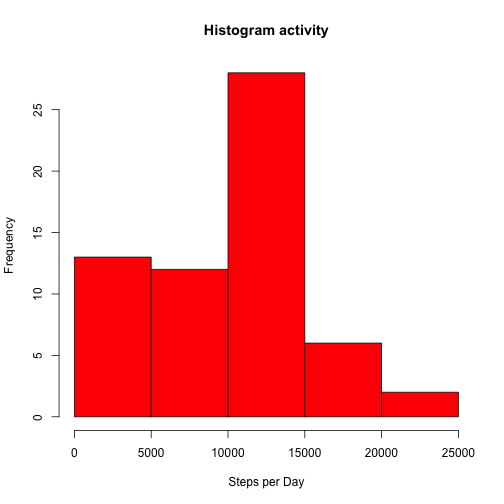
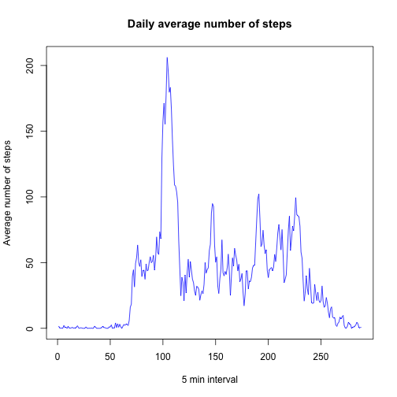
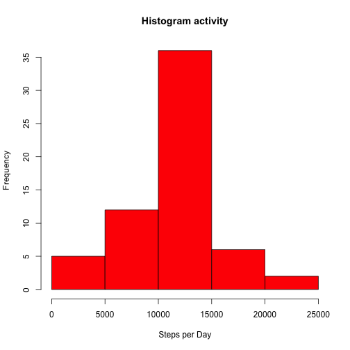
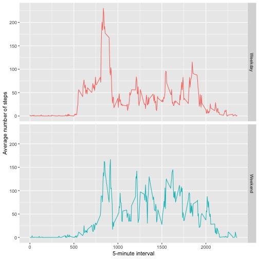

Reproducible research project week 2
=========
# Code for reading in the dataset and/or processing the data

## Reading file

```r
data <- read.csv("activity.csv")
str(data)
```

```
## 'data.frame':	17568 obs. of  3 variables:
##  $ steps   : int  NA NA NA NA NA NA NA NA NA NA ...
##  $ date    : Factor w/ 61 levels "2012-10-01","2012-10-02",..: 1 1 1 1 1 1 1 1 1 1 ...
##  $ interval: int  0 5 10 15 20 25 30 35 40 45 ...
```

```r
summary(data)
```

```
##      steps                date          interval     
##  Min.   :  0.00   2012-10-01:  288   Min.   :   0.0  
##  1st Qu.:  0.00   2012-10-02:  288   1st Qu.: 588.8  
##  Median :  0.00   2012-10-03:  288   Median :1177.5  
##  Mean   : 37.38   2012-10-04:  288   Mean   :1177.5  
##  3rd Qu.: 12.00   2012-10-05:  288   3rd Qu.:1766.2  
##  Max.   :806.00   2012-10-06:  288   Max.   :2355.0  
##  NA's   :2304     (Other)   :15840
```

```r
head(data)
```

```
##   steps       date interval
## 1    NA 2012-10-01        0
## 2    NA 2012-10-01        5
## 3    NA 2012-10-01       10
## 4    NA 2012-10-01       15
## 5    NA 2012-10-01       20
## 6    NA 2012-10-01       25
```

## Transforming column date to Date type

```r
data$date <- as.Date(as.character(data$date))
```

# Histogram of the total number of steps taken each day

```r
stepsDay <- with(data,tapply(steps,date,sum,na.rm=TRUE))
hist(stepsDay, main = "Histogram activity",xlab = "Steps per Day", col = "red")
```



# Mean and median number of steps taken each day

```r
mean(stepsDay)
```

```
## [1] 9354.23
```

```r
median(stepsDay)
```

```
## [1] 10395
```

# Time series plot of the average number of steps taken

```r
meanSteps <- with(data,tapply(steps,interval,mean,na.rm=TRUE))
plot(meanSteps,main = "Daily average number of steps",type = "l",col="blue",
     ylab = "Average number of steps",xlab = "5 min interval")
```



# The 5-minute interval that, on average, contains the maximum number of steps

```r
maxInterval <- data$interval[grep(max(meanSteps),meanSteps)]
```

# Code to describe and show a strategy for imputing missing data

```r
library(dplyr)
```

```
## 
## Attaching package: 'dplyr'
```

```
## The following objects are masked from 'package:stats':
## 
##     filter, lag
```

```
## The following objects are masked from 'package:base':
## 
##     intersect, setdiff, setequal, union
```

```r
meanInt <- function(x){replace(x, is.na(x), mean(x, na.rm = TRUE))}
newData <- data %>% 
  group_by(interval) %>%
  mutate(steps = meanInt(steps))
head(newData)
```

```
## # A tibble: 6 x 3
## # Groups:   interval [6]
##    steps date       interval
##    <dbl> <date>        <int>
## 1 1.72   2012-10-01        0
## 2 0.340  2012-10-01        5
## 3 0.132  2012-10-01       10
## 4 0.151  2012-10-01       15
## 5 0.0755 2012-10-01       20
## 6 2.09   2012-10-01       25
```

# Histogram of the total number of steps taken each day after missing values are imputed

```r
stepsDayNew <- with(newData,tapply(steps,date,sum,na.rm=TRUE))
hist(stepsDayNew, main = "Histogram activity",xlab = "Steps per Day", col = "red")
```



## New Mean and Median steps per day

```r
mean(stepsDayNew)
```

```
## [1] 10766.19
```

```r
median(stepsDayNew)
```

```
## [1] 10766.19
```

### Do these values differ from the estimates from the first part of the assignment? 
YES  

### What is the impact of imputing missing data on the estimates of the total daily number of steps?  
The new histogram shows a normal distribution, new mean and new median have the same value

### Are there differences in activity patterns between weekdays and weekends?

```r
newData$weekday <- weekdays(data$date)
newData$weekcat <- ifelse(newData$weekday %in% c("Saturday","Sunday"),"Weekend","Weekday")
```

# Panel plot comparing the average number of steps taken per 5-minute interval across weekdays and weekends

```r
stepsMean <- aggregate(newData$steps,by=list(newData$interval,newData$weekcat),mean)
colnames(stepsMean) <- c("Interval","Weekcat","Stepsmean")
str(stepsMean)
```

```
## 'data.frame':	576 obs. of  3 variables:
##  $ Interval : int  0 5 10 15 20 25 30 35 40 45 ...
##  $ Weekcat  : chr  "Weekday" "Weekday" "Weekday" "Weekday" ...
##  $ Stepsmean: num  2.251 0.445 0.173 0.198 0.099 ...
```

```r
library(ggplot2)
ggplot(stepsMean,aes(Interval,Stepsmean,color=Weekcat)) +
  geom_line() +
  facet_grid(Weekcat~.) + 
  labs(y="Average number of steps", x="5-minute interval") + 
  theme(legend.position = "none")
```


